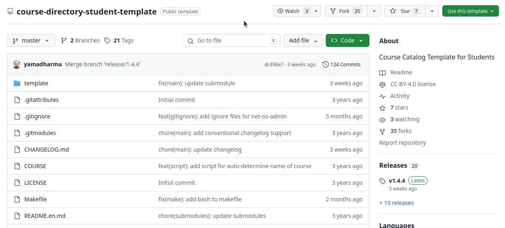
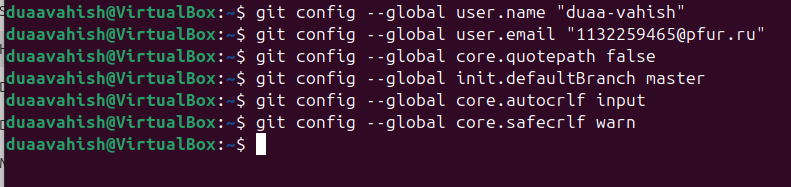
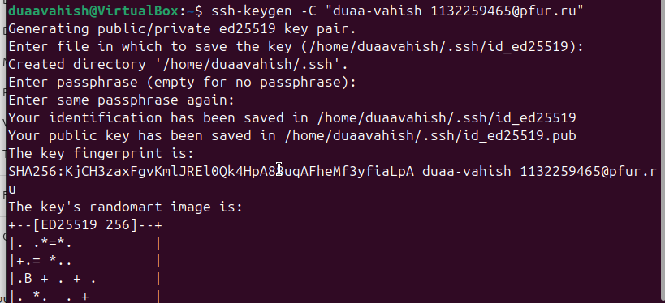
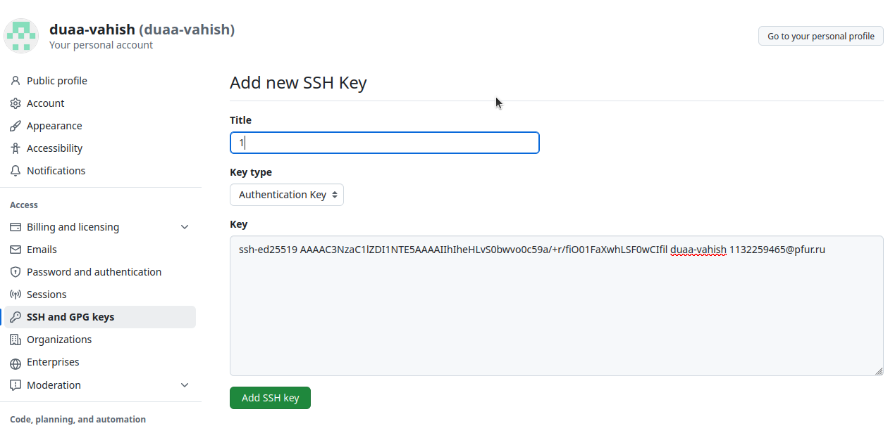
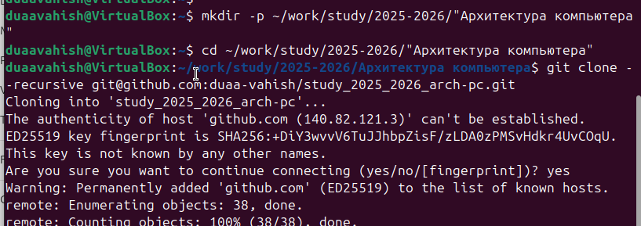
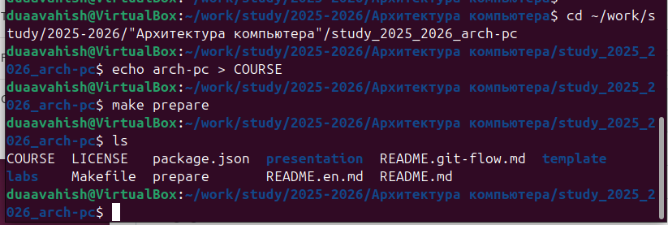
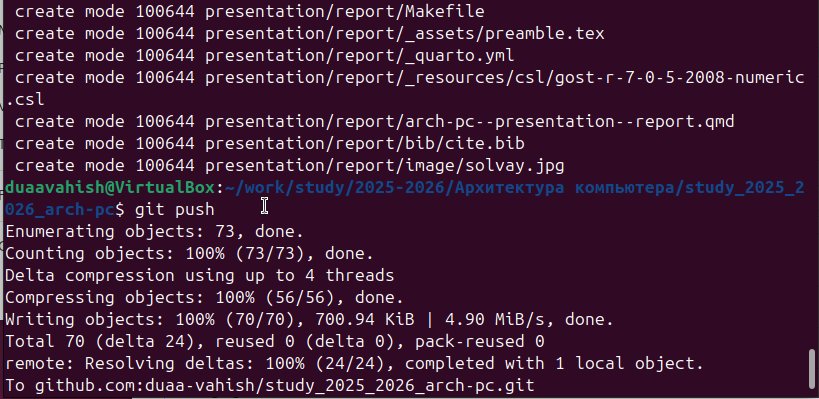
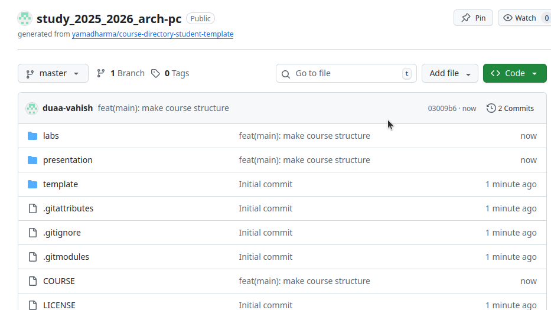
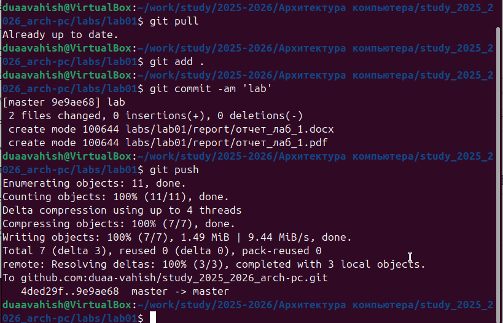
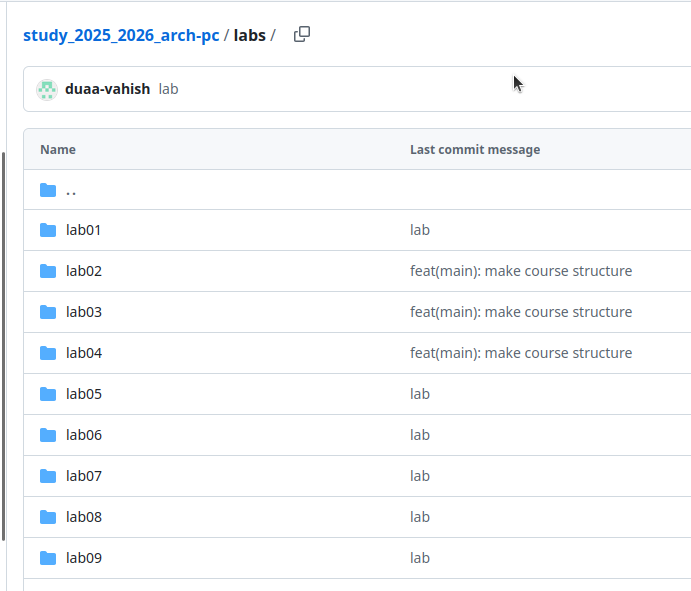

---
## Author
author:
  name: Вахиш Дуаа Иссам Али Ахмед
  email: 1132259465@pfur.ru
  affiliation:
    - name: Российский университет дружбы народов
      country: Российская Федерация
      postal-code: 117198
      city: Москва
      address: ул. Миклухо-Маклая, д. 6

## Title
title: "Отчёт по лабораторной работе 2"
subtitle: "Система контроля версий Git"
license: "CC BY"
---

# Цель работы

Целью работы является изучить идеологию и применение средств контроля версий. Приобрести практические навыки по работе с системой git.

# Выполнение лабораторной работы

Регистрируюсь на гитхабе.
Нахожу шаблонный репозиторий и создаю из него свой.

{ #fig:001 width=70%, height=70% }

Сначала сделаем предварительную конфигурацию git, создаю пользователя и ставлю параметры.

{ #fig:002 width=70%, height=70% }

Далее создаю ключи для идентификации.

{ #fig:003 width=70%, height=70% }

И добавляю ключ в профиль на гитхабе

{ #fig:004 width=70%, height=70% }

Теперь я создаю рабочий каталог и клонирую туда репозиторий с гитхаба.

{ #fig:005 width=70%, height=70% }

Создаю курс и структуру папок

{ #fig:006 width=70%, height=70% }

Отправляю в гитхаб

{ #fig:007 width=70%, height=70% }

{ #fig:008 width=70%, height=70% }

Загружаю отчеты по работам на гитхаб. 

{ #fig:009 width=70%, height=70% }

{ #fig:010 width=70%, height=70% }

# Выводы

В ходе выполнения работы изучили работу с GitHub.

