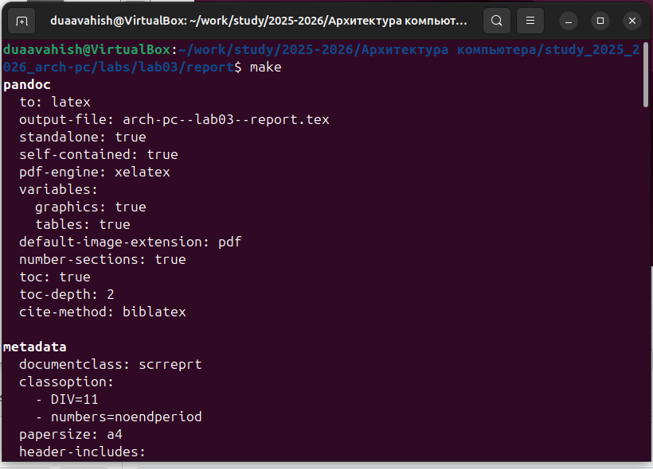
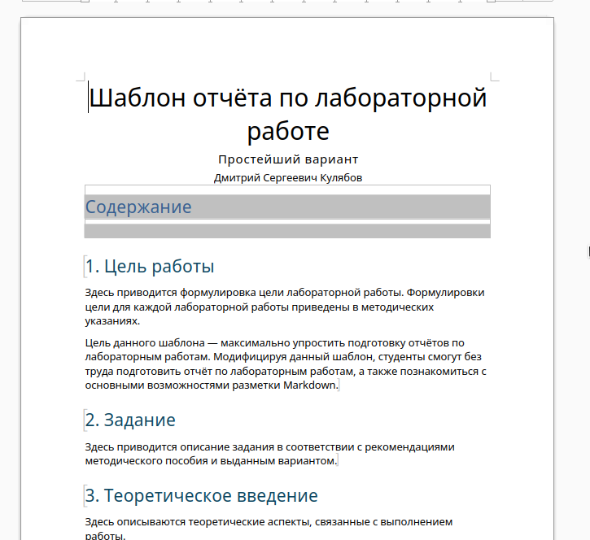
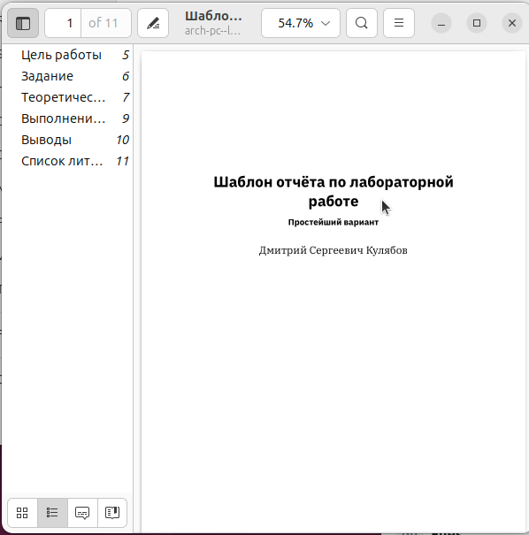
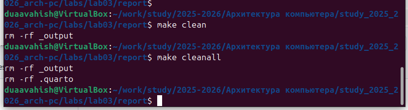
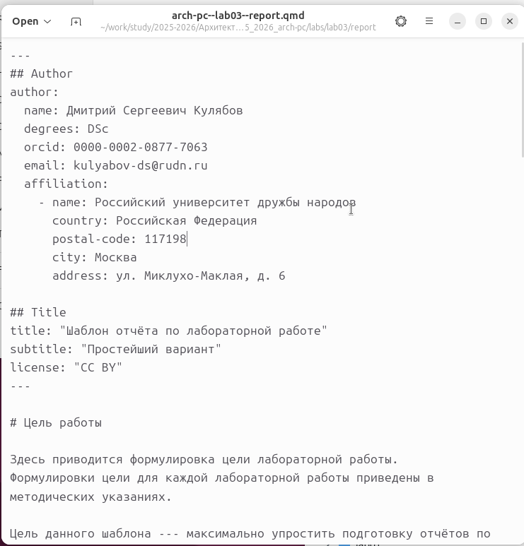
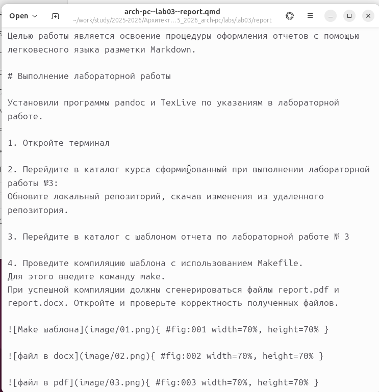
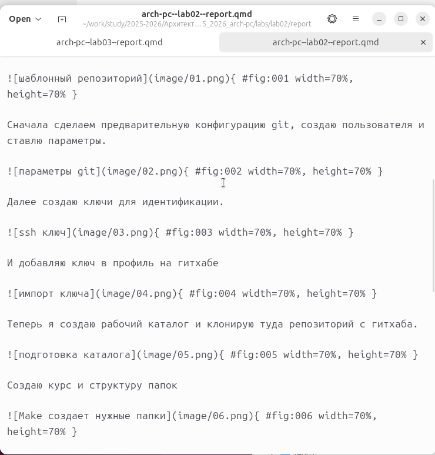
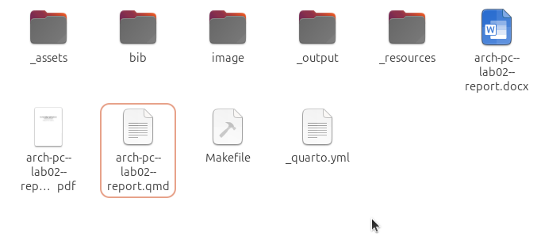

---
## Author
author:
  name: Вахиш Дуаа Иссам Али Ахмед
  email: 1132259465@pfur.ru
  affiliation:
    - name: Российский университет дружбы народов
      country: Российская Федерация
      postal-code: 117198
      city: Москва
      address: ул. Миклухо-Маклая, д. 6

## Title
title: "Отчёт по лабораторной работе 3"
subtitle: "Система контроля версий Git"
license: "CC BY"
---

# Цель работы

Целью работы является освоение процедуры оформления отчетов с помощью легковесного языка разметки Markdown.

# Выполнение лабораторной работы

Установили программы pandoc и TexLive по указаниям в лабораторной работе. 

1. Откройте терминал

2. Перейдите в каталог курса сформированный при выполнении лабораторной работы №3:
Обновите локальный репозиторий, скачав изменения из удаленного репозитория.

3. Перейдите в каталог с шаблоном отчета по лабораторной работе № 3

4. Проведите компиляцию шаблона с использованием Makefile. 
Для этого введите команду make.
При успешной компиляции должны сгенерироваться файлы report.pdf и
report.docx. Откройте и проверьте корректность полученных файлов. 

{ #fig:001 width=70%, height=70% }

{ #fig:002 width=70%, height=70% }

{ #fig:003 width=70%, height=70% }

5. Удалите полученный файлы с использованием Makefile. Для этого введитекоманду make clean
Проверьте, что после этой команды файлы report.pdf и report.docx были удалены.

{ #fig:004 width=70%, height=70% }

6. Откройте файл report.md c помощью любого текстового редактора, например gedit
Внимательно изучите структуру этого файла.

{ #fig:005 width=70%, height=70% }

7. Заполните отчет и скомпилируйте отчет с использованием Makefile. 
Проверьте корректность полученных файлов.
(Обратите внимание, для корректного отображения скриншотов они должны быть размещены в каталоге image)

{ #fig:006 width=70%, height=70% }

8. Загрузите файлы на Github.

### Задание для самостоятельной работы

Сделал отчет для лабораторной номер 2 и загрузил на гитхаб.

{ #fig:007 width=70%, height=70% }

{ #fig:008 width=70%, height=70% }

# Выводы

Изучили синтаксис языка разметки Markdown, получили отчет из шаблона при помощи Makefile. 

