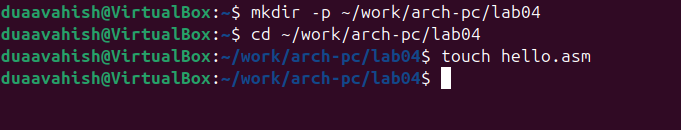
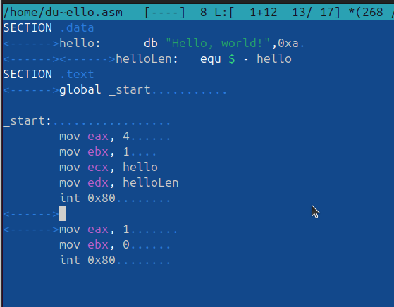
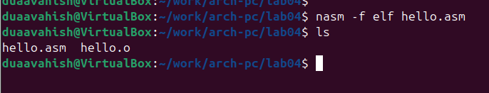
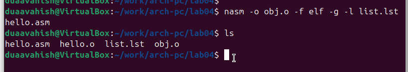
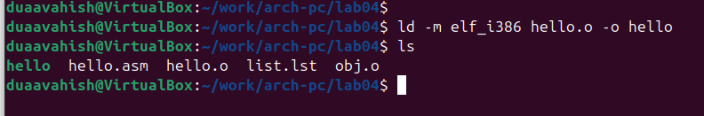
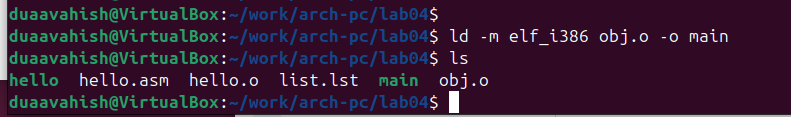
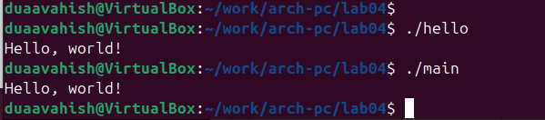
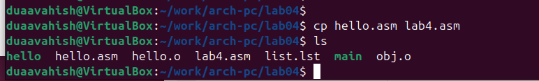
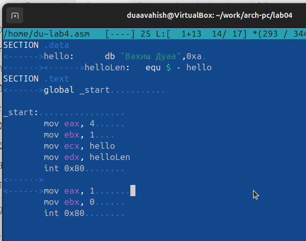
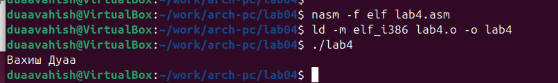

---
## Author
author:
  name: Вахиш Дуаа Иссам Али Ахмед
  email: 1132259465@pfur.ru
  affiliation:
    - name: Российский университет дружбы народов
      country: Российская Федерация
      postal-code: 117198
      city: Москва
      address: ул. Миклухо-Маклая, д. 6

## Title
title: "Отчёт по лабораторной работе 4"
subtitle: "Система контроля версий Git"
license: "CC BY"
---

# Цель работы

Целью работы является освоение процедуры компиляции и сборки программ, написанных на ассемблере NASM.

# Выполнение лабораторной работы

## Программа Hello world!

Создала каталог lab04 командой mkdir, перешла в него с помощью команды cd 
и создала файл hello.asm, в который напишу программу.
Убеждаюсь с помощью команды ls, что создал файл.

{ #fig:001 width=70%, height=70% }

Написала программу по заданию на языке ассемблера.

{ #fig:002 width=70%, height=70% }

## Транслятор NASM

NASM превращает текст программы в объектный код. Если текст программы набран без ошибок, то транслятор преобразует текст программы из файла hello.asm в объектный код, который запишется в файл hello.o. 

Транслировала файл командой nasm. Получился объектный файл hello.o.

{ #fig:003 width=70%, height=70% }

## Расширенный синтаксис командной строки NASM

Полный вариант командной строки nasm выглядит следующим образом: 

```bash

nasm [-@ косвенный_файл_настроек] [-o объектный_файл] [-f формат_объектного_файла] [-l листинг] [параметры...] [--] исходный_файл

```

Транслировала файл командой nasm с дополнительными опциями. 
С опцией -l Получил файл листинга list.lst, с опцией -f объектный файл obj.o, с опцией -g в программу добавилась отладочная информация.

{ #fig:004 width=70%, height=70% }

## Компоновщик LD

Чтобы получить исполняемую программу, объектный файл необходимо передать на обработку компоновщику.

Выполнила команду ld и получила исполняемый файл hello из объектного файла hello.o.

{ #fig:005 width=70%, height=70% }

Еще раз выполнила команду ld для объектного файла obj.o и получила исполняемый файл main.

{ #fig:006 width=70%, height=70% }

## Запуск исполняемого файла

Запустила исполняемые файлы.

{ #fig:007 width=70%, height=70% }

## Задание для самостоятельной работы

Скопировала файл hello.asm в файл lab4.asm.

{ #fig:008 width=70%, height=70% }

Изменила сообщение Hello world на свое имя.

{ #fig:009 width=70%, height=70% }

Запустила программу и проверила.

{ #fig:010 width=70%, height=70% }

# Выводы

Освоили процесс компиляции и сборки программ, написанных на ассемблере nasm.

