---
## Author
author:
  name: Вахиш Дуаа Иссам Али Ахмед
  email: 1132259465@pfur.ru
  affiliation:
    - name: Российский университет дружбы народов
      country: Российская Федерация
      postal-code: 117198
      city: Москва
      address: ул. Миклухо-Маклая, д. 6

## Title
title: "Отчёт по лабораторной работе 8"
subtitle: "Программирование цикла. Обработка аргументов командной строки."
license: "CC BY"
---

# Цель работы

Целью работы является приобретение навыков написания программ с использованием циклов и обработкой аргументов командной строки..

# Выполнение лабораторной работы

## Реализация циклов в NASM

Создала каталог для программ лабораторной работы № 8 и файл lab8-1.asm.

При реализации циклов в NASM с использованием инструкции loop необходимо помнить, что эта инструкция использует регистр ecx в качестве счетчика, уменьшая его значение на единицу с каждым шагом. В качестве примера я рассмотрела программу, которая выводит текущее значение регистра ecx. 

Добавила в файл lab8-1.asm текст программы из листинга 8.1. Затем создала исполняемый файл и проверила его работу.

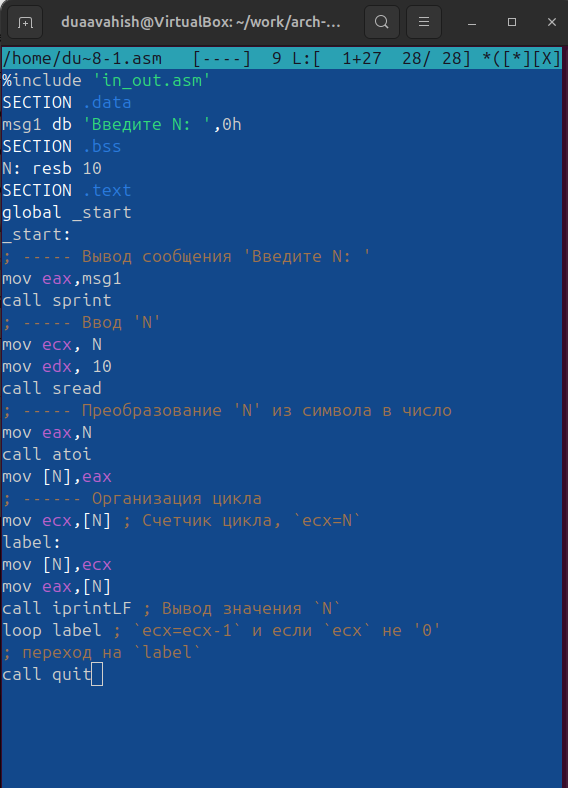{ #fig:001 width=70%, height=70% }

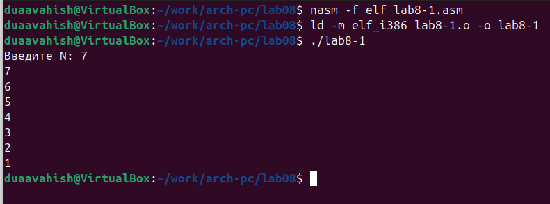{ #fig:002 width=70%, height=70% }

Этот пример показал, что изменение регистра ecx внутри цикла loop может привести к некорректной работе программы. Я изменила текст программы, добавив модификацию регистра ecx в цикле. 

Полученная программа:
- Запускает бесконечный цикл при нечетном значении N.
- Выводит только нечетные числа, если N четное.

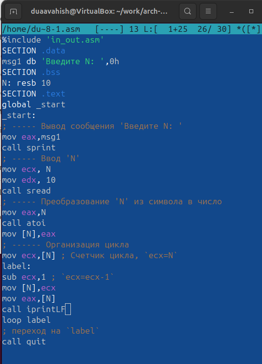{ #fig:003 width=70%, height=70% }

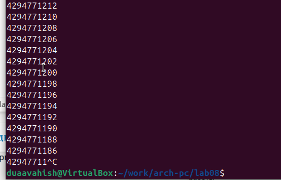{ #fig:004 width=70%, height=70% }

Для корректного использования регистра ecx в цикле, я добавила команды push и pop, чтобы временно сохранять значение регистра в стеке. Это позволило сохранить корректность работы программы. Внесла изменения в текст программы, создала исполняемый файл и проверила его работу. 

Теперь программа:
- Выводит числа от N-1 до 0.
- Число проходов цикла соответствует значению N.

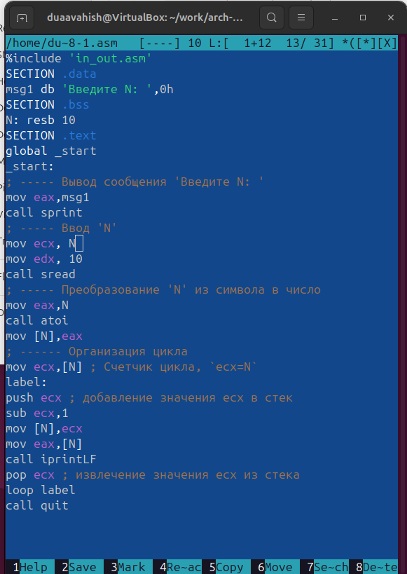{ #fig:005 width=70%, height=70% }

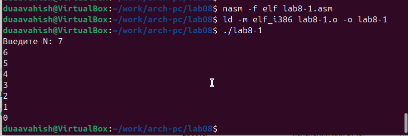{ #fig:006 width=70%, height=70% }

## Обработка аргументов командной строки

Создала файл lab8-2.asm в каталоге ~/work/arch-pc/lab08 и ввела в него текст программы из листинга 8.2.

Создала исполняемый файл и запустила его, указав аргументы. Программа обработала 4 аргумента, разделенных пробелами (слова или числа).

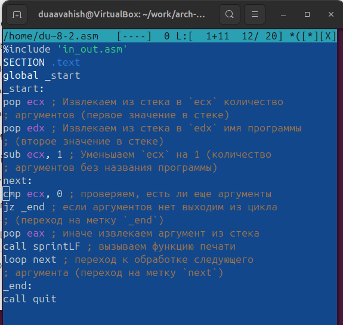{ #fig:007 width=70%, height=70% }

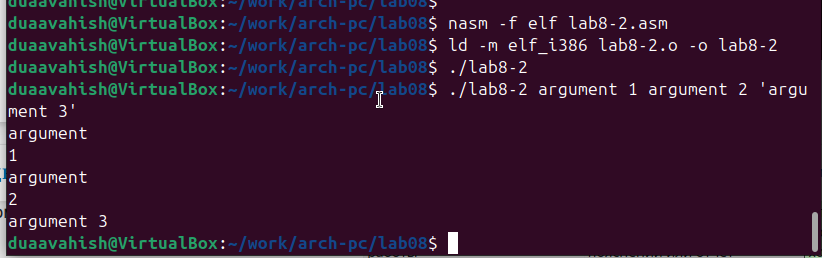{ #fig:008 width=70%, height=70% }

Рассмотрела пример программы, которая выводит сумму чисел, переданных в качестве аргументов командной строки.

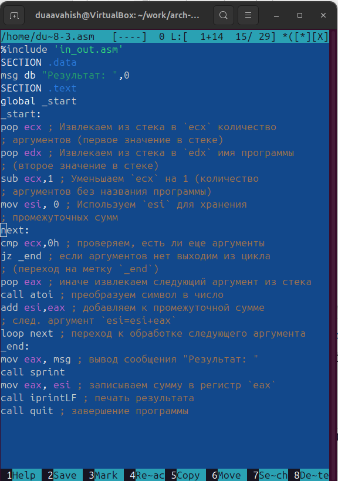{ #fig:009 width=70%, height=70% }

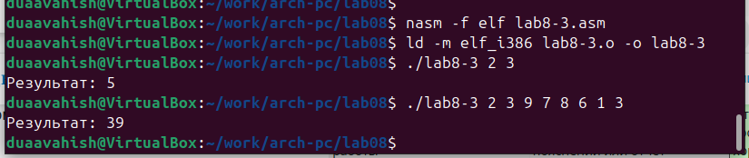{ #fig:010 width=70%, height=70% }

Изменила текст программы из листинга 8.3, чтобы вычислять произведение аргументов.

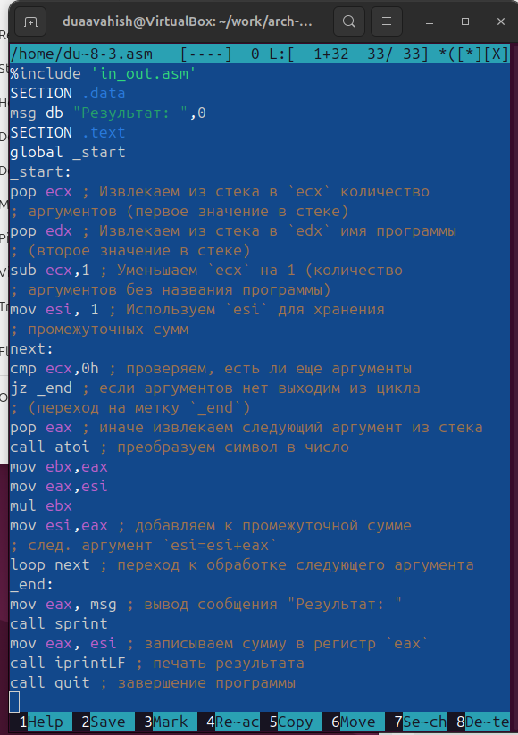{ #fig:011 width=70%, height=70% }

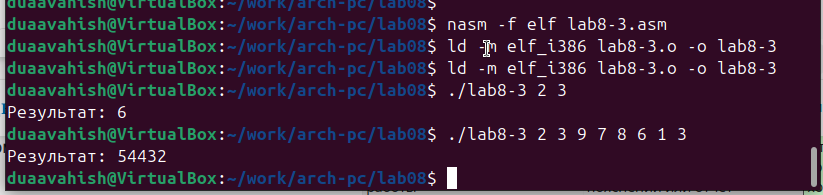{ #fig:012 width=70%, height=70% }

## Задание для самостоятельной работы

Написала программу для нахождения суммы значений функции $f(x)$ для $x = x_1, x_2, ..., x_n$. Программа должна выводить значение $f(x_1) + f(x_2)+ ... + f(x_n)$. 

Значения $x$ передаются в программу как аргументы. 
Для функции $f(x)$ выбрала вариант 6: $f(x) = 4x-3$. 

Создала исполняемый файл и проверила его работу на нескольких наборах значений $x$.

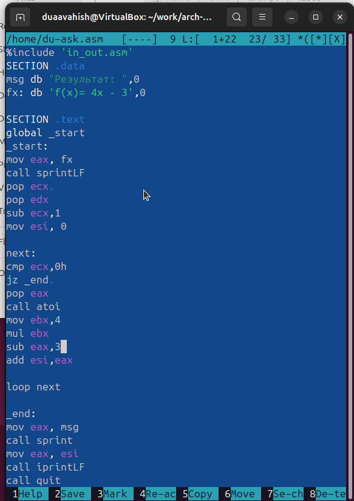{ #fig:013 width=70%, height=70% }

Для проверки запустила программу сначала с одним аргументом:
- При $x=1$, $f(1) = 1$.
- При $x=2$, $f(2) = 5$.

Затем передала несколько аргументов и получила сумму значений функции.

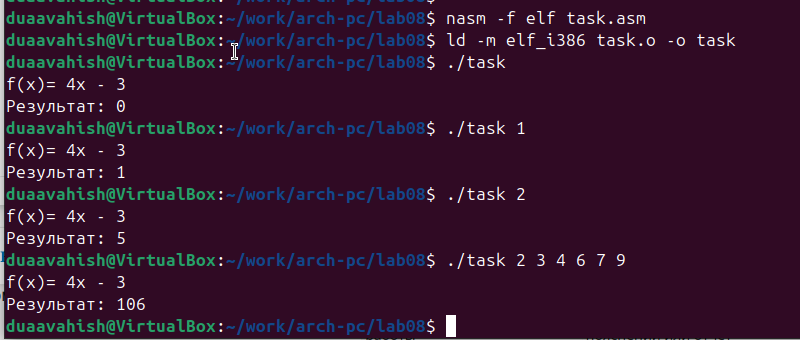{ #fig:014 width=70%, height=70% }

# Выводы

Освоили работы со стеком, циклом и аргументами на ассемблере nasm.

