---
## Author
author:
  name: Вахиш Дуаа Иссам Али Ахмед
  email: 1132259465@pfur.ru
  affiliation:
    - name: Российский университет дружбы народов
      country: Российская Федерация
      postal-code: 117198
      city: Москва
      address: ул. Миклухо-Маклая, д. 6

## Title
title: "Отчёт по лабораторной работе 9"
subtitle: "Программирование цикла. Обработка аргументов командной строки."
license: "CC BY"
---

# Цель работы

Целью работы является приобретение навыков написания программ с использованием подпрограмм.
Знакомство с методами отладки при помощи GDB и его основными возможностями.

# Выполнение лабораторной работы

## Реализация подпрограмм в NASM

Я создала каталог для выполнения лабораторной работы №9 и перешла в него.

В качестве примера рассмотрим программу, которая вычисляет арифметическое выражение \( f(x) = 2x + 7 \) с использованием подпрограммы calcul. В этом примере значение \( x \) вводится с клавиатуры, а само выражение вычисляется в подпрограмме.

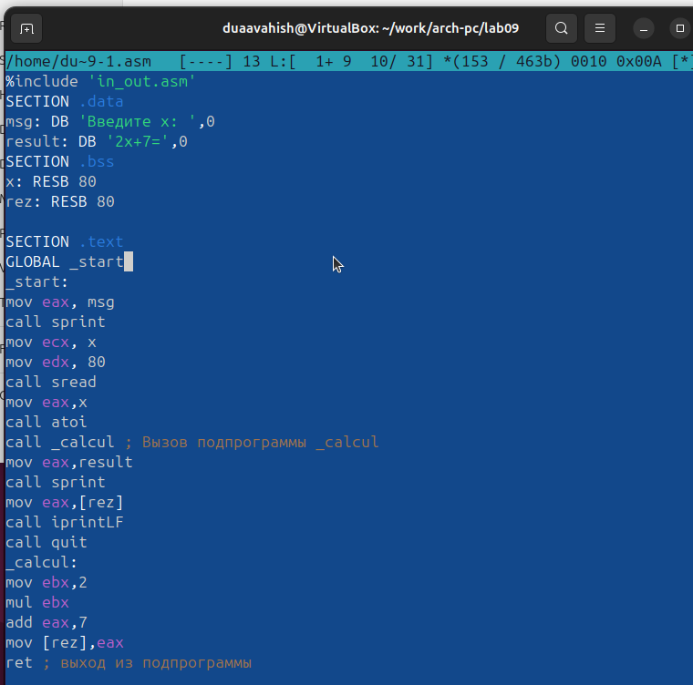{ #fig:001 width=70%, height=70% }

Первые строки программы отвечают за вывод сообщения на экран (с помощью вызова sprint), чтение данных, введенных с клавиатуры (с помощью вызова sread) и преобразование введенных данных из символьного вида в численный (с помощью вызова atoi).

После инструкции call _calcul, которая передает управление подпрограмме _calcul, будут выполнены инструкции, содержащиеся в подпрограмме.

Инструкция ret является последней в подпрограмме и её выполнение приводит к возврату в основную программу к инструкции, следующей за инструкцией call, которая вызвала данную подпрограмму.

Последние строки программы реализуют вывод сообщения (с помощью вызова sprint), вывод результата вычисления (с помощью вызова iprintLF) и завершение программы (с помощью вызова quit).

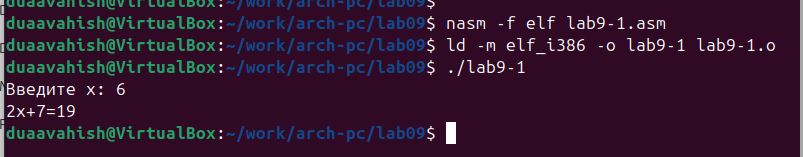{ #fig:002 width=70%, height=70% }

Я изменила текст программы, добавив подпрограмму subcalcul в подпрограмму calcul, для вычисления выражения \( f(g(x)) \), где \( x \) вводится с клавиатуры, \( f(x) = 2x + 7, g(x) = 3x - 1 \).

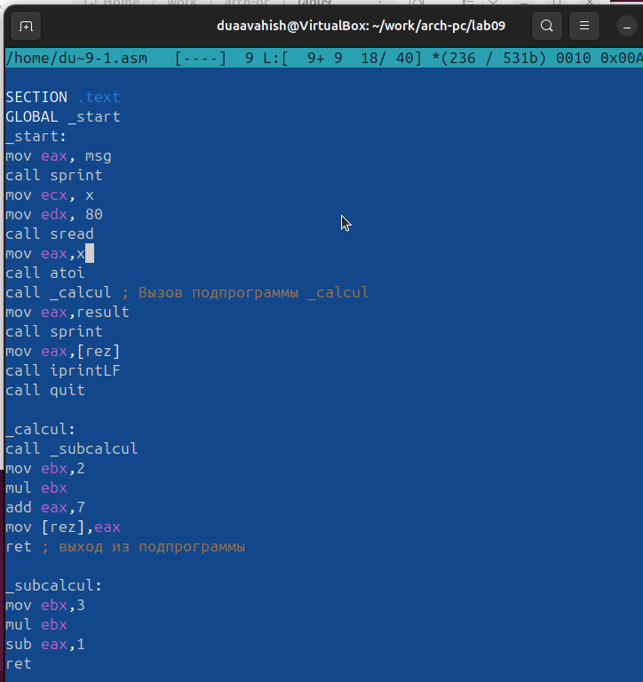{ #fig:003 width=70%, height=70% }

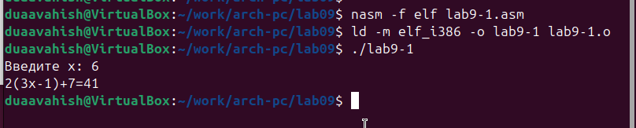{ #fig:004 width=70%, height=70% }

## Отладка программ с помощью GDB

Я создала файл lab9-2.asm с текстом программы из Листинга 9.2 (Программа печати сообщения Hello world!).

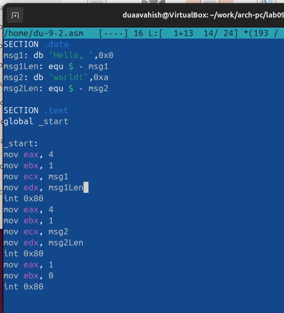{ #fig:005 width=70%, height=70% }

После того как я получила исполняемый файл, для работы с GDB в исполняемый файл необходимо добавить отладочную информацию, для чего трансляцию программ следует проводить с ключом -g.

Загрузила исполняемый файл в отладчик GDB и проверила работу программы, запустив её в оболочке GDB с помощью команды run (сокращенно r).

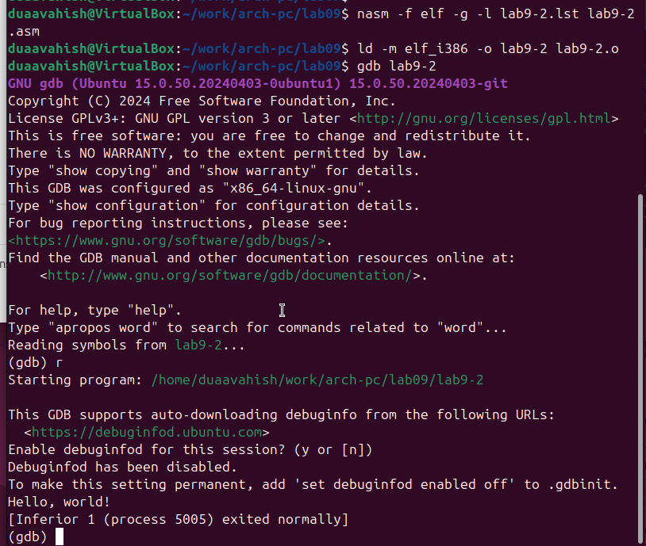{ #fig:006 width=70%, height=70% }

Для более подробного анализа программы установила брейкпоинт на метку start, с которой начинается выполнение любой ассемблерной программы, и запустила её. Посмотрела дизассемблированный код программы.

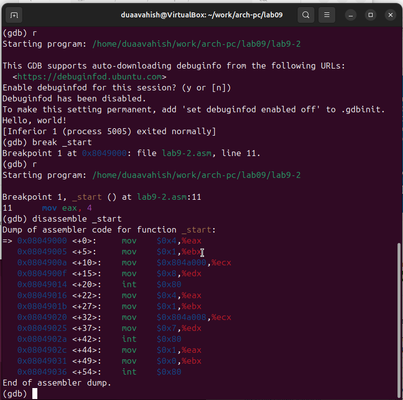{ #fig:007 width=70%, height=70% }

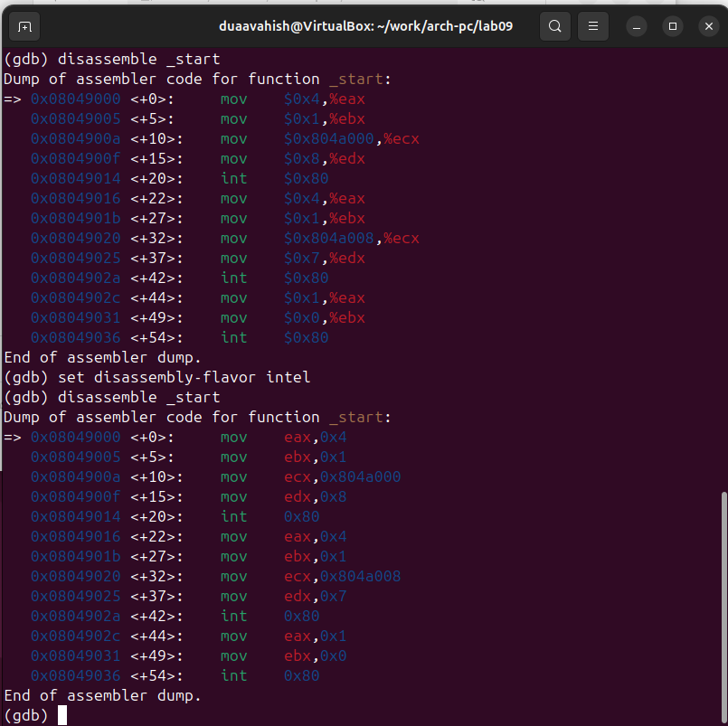{ #fig:008 width=70%, height=70% }

Для установки точки останова использовала команду break (кратко b). Типичный аргумент этой команды — место установки. Его можно задать либо как номер строки программы (если есть исходный файл и программа компилировалась с отладочной информацией), либо как имя метки, или как адрес. Чтобы избежать путаницы с номерами, перед адресом ставится «звездочка».

На предыдущих шагах была установлена точка останова по имени метки _start. Проверила это с помощью команды info breakpoints (кратко i b).
Затем установила ещё одну точку останова по адресу инструкции. Адрес инструкции можно увидеть в средней части экрана в левом столбце соответствующей инструкции. Определила адрес предпоследней инструкции (mov ebx,0x0) и установила точку.

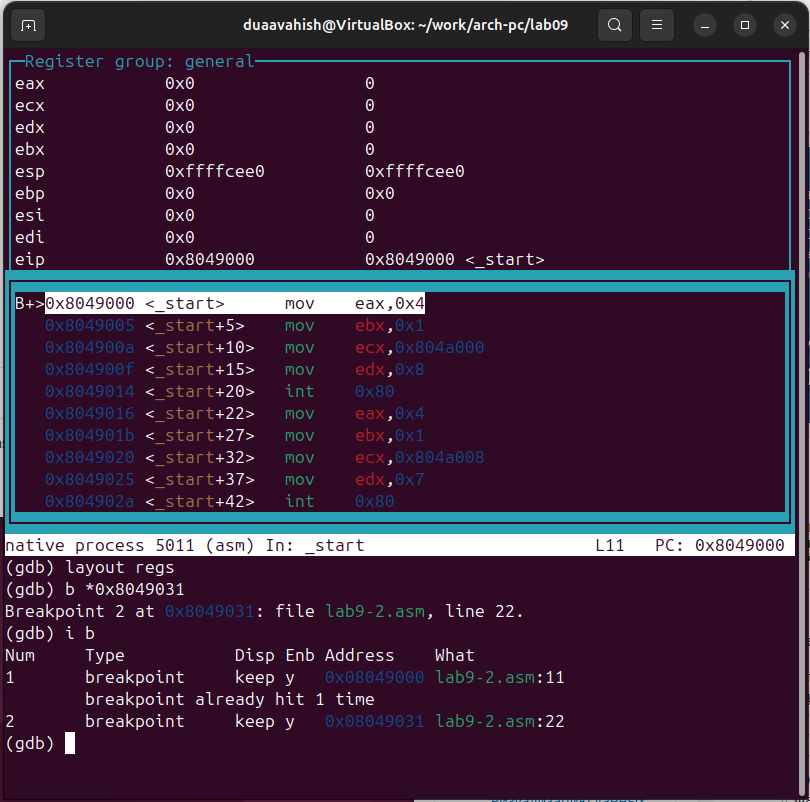{ #fig:009 width=70%, height=70% }

Отладчик может показывать содержимое ячеек памяти и регистров, а при необходимости позволяет вручную изменять значения регистров и переменных. Я выполнила 5 инструкций с помощью команды stepi (или si) и проследила за изменением значений регистров.

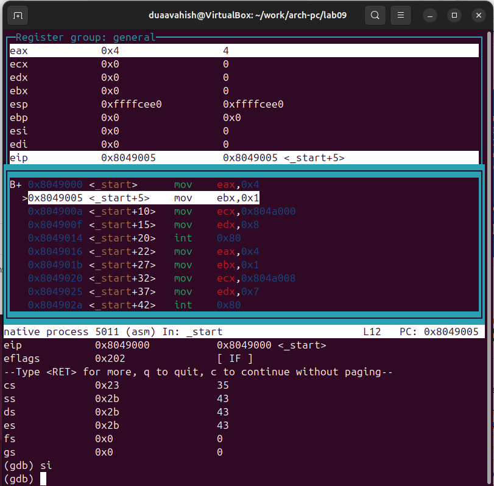{ #fig:010 width=70%, height=70% }

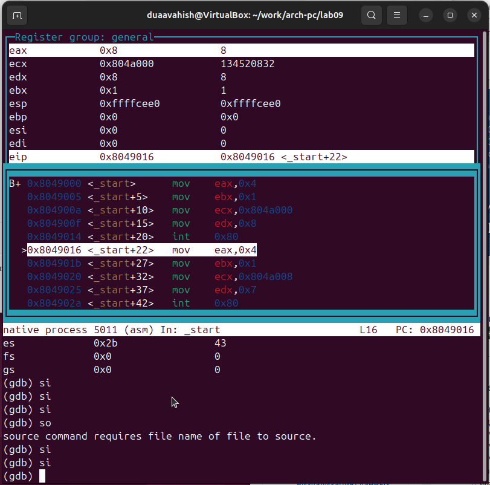{ #fig:011 width=70%, height=70% }

Посмотрела значение переменной msg1 по имени и значение переменной msg2 по адресу.

Изменить значение для регистра или ячейки памяти можно с помощью команды set, указав имя регистра или адрес. Я изменила первый символ переменной msg1.

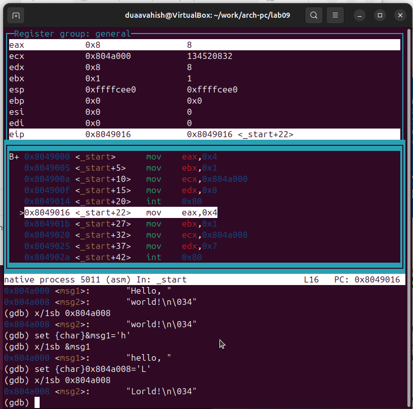{ #fig:012 width=70%, height=70% }

Я вывела значение регистра edx в различных форматах (в шестнадцатеричном, двоичном и символьном).

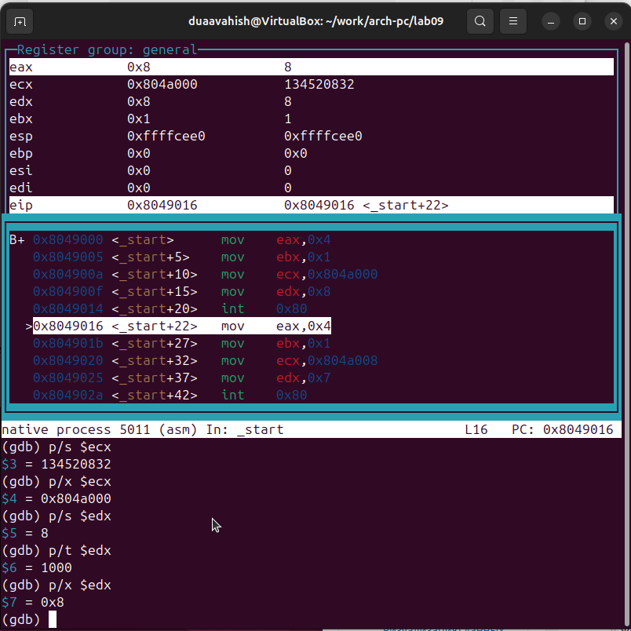{ #fig:013 width=70%, height=70% }

С помощью команды set изменила значение регистра ebx.

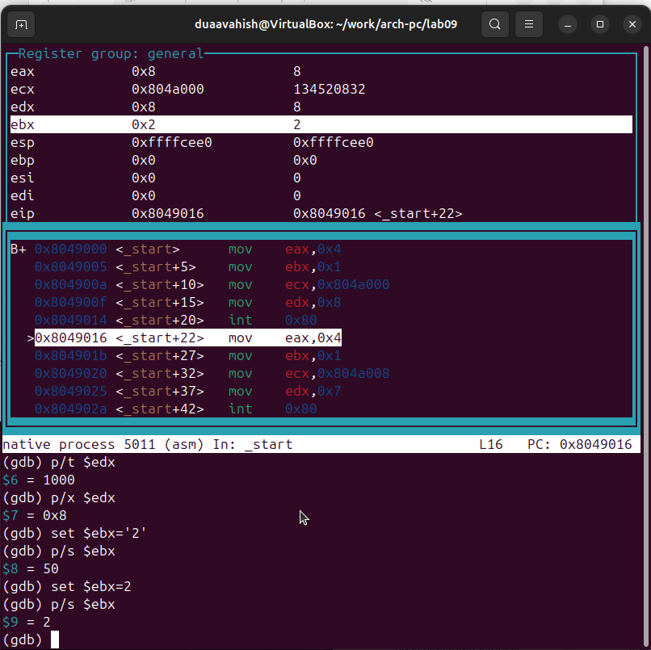{ #fig:014 width=70%, height=70% }

Я скопировала файл lab8-2.asm, созданный при выполнении лабораторной работы №8, с программой, выводящей на экран аргументы командной строки. Создала исполняемый файл. Для загрузки программы с аргументами в GDB необходимо использовать ключ --args. Загрузила исполняемый файл в отладчик, указав аргументы.

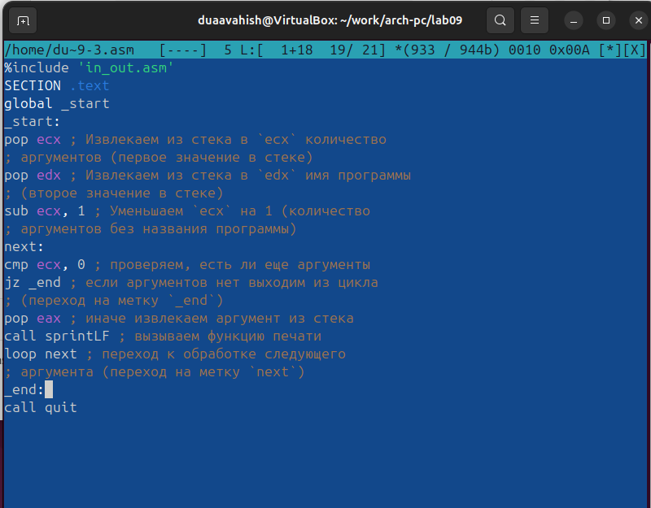{ #fig:015 width=70%, height=70% }

Для начала установила точку останова перед первой инструкцией в программе и запустила её.

Адрес вершины стека хранится в регистре esp, и по этому адресу располагается число, равное количеству аргументов командной строки (включая имя программы). Как видно, число аргументов равно 5 — это имя программы lab9-3 и непосредственно аргументы: аргумент1, аргумент2 и аргумент 3.

Посмотрела остальные позиции стека — по адресу [esp+4] располагается адрес в памяти, где находится имя программы, по адресу [esp+8] — адрес первого аргумента, по адресу [esp+12] — второго и т.д.

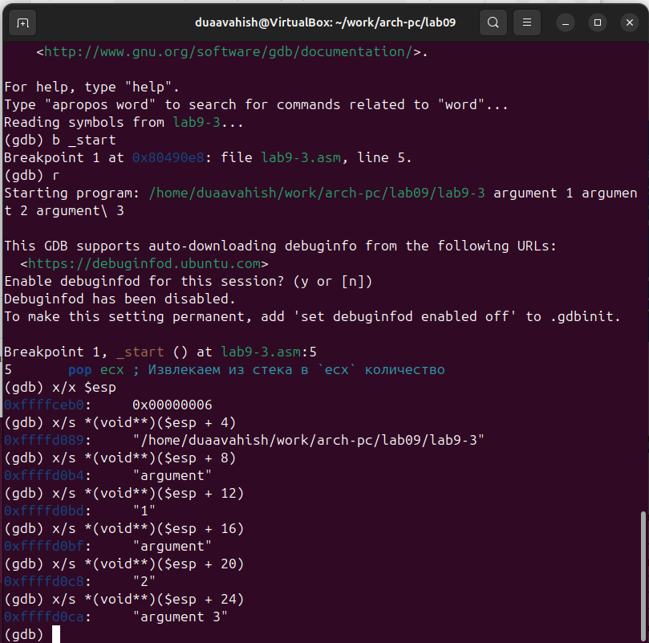{ #fig:016 width=70%, height=70% }

Объяснила, почему шаг изменения адреса равен 4 ([esp+4], [esp+8], [esp+12]) — шаг равен размеру переменной (4 байта).

## Задание для самостоятельной работы

Я переписала программу из лабораторной работы №8, чтобы вычислить значение функции \( f(x) \) в виде подпрограммы.

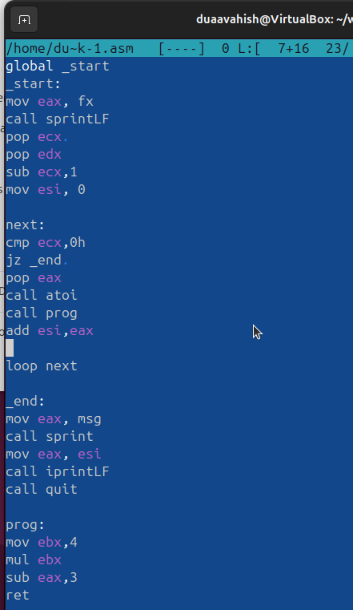{ #fig:017 width=70%, height=70% }

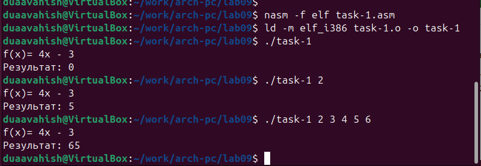{ #fig:018 width=70%, height=70% }

Приведенный ниже листинг программы вычисляет выражение \( (3+2)*4+5 \). Однако при запуске программа дает неверный результат. Я проверила это и решила использовать отладчик GDB для анализа изменений значений регистров и определения ошибки.

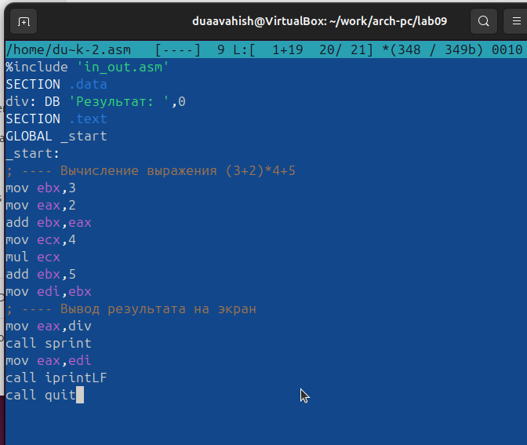{ #fig:019 width=70%, height=70% }

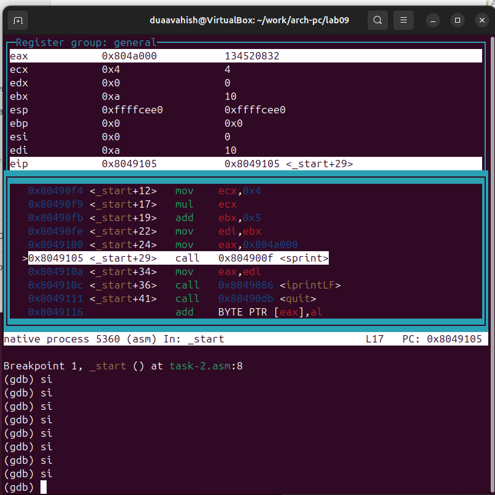{ #fig:020 width=70%, height=70% }

Я заметила, что порядок аргументов в инструкции add был перепутан, и что при завершении работы вместо eax значение отправлялось в edi. Вот исправленный код программы:

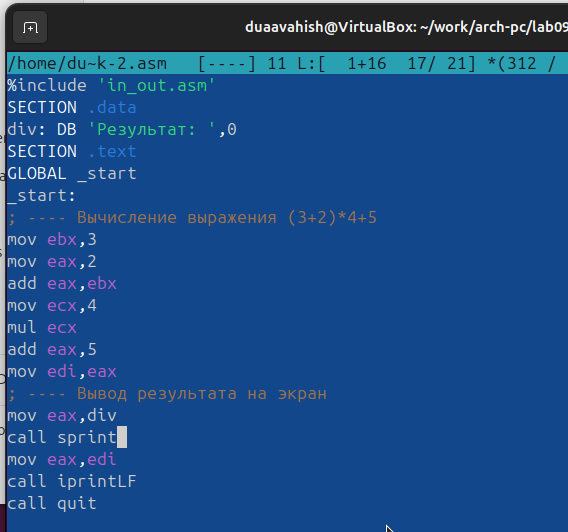{ #fig:021 width=70%, height=70% }

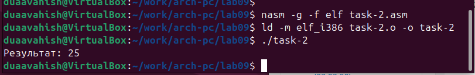{ #fig:022 width=70%, height=70% }

# Выводы

Освоили работy с подпрограммами и отладчиком.
